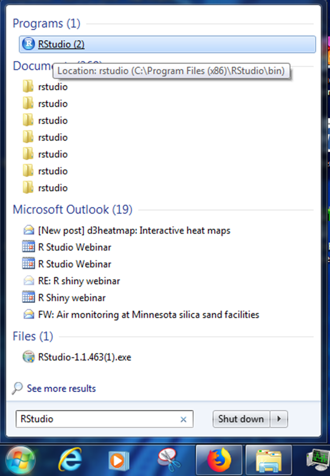
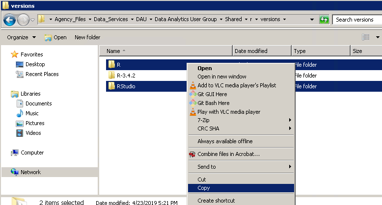
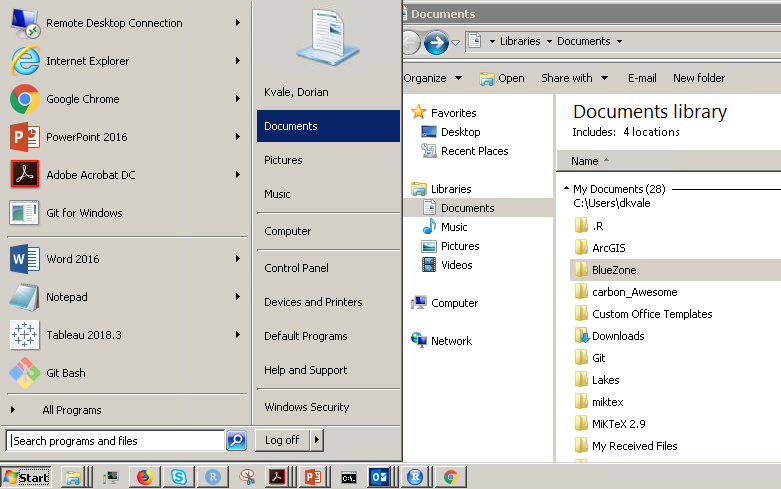
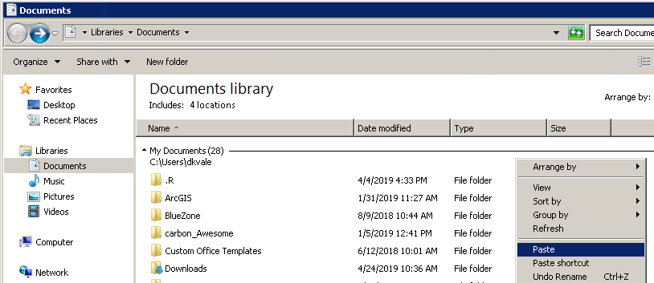
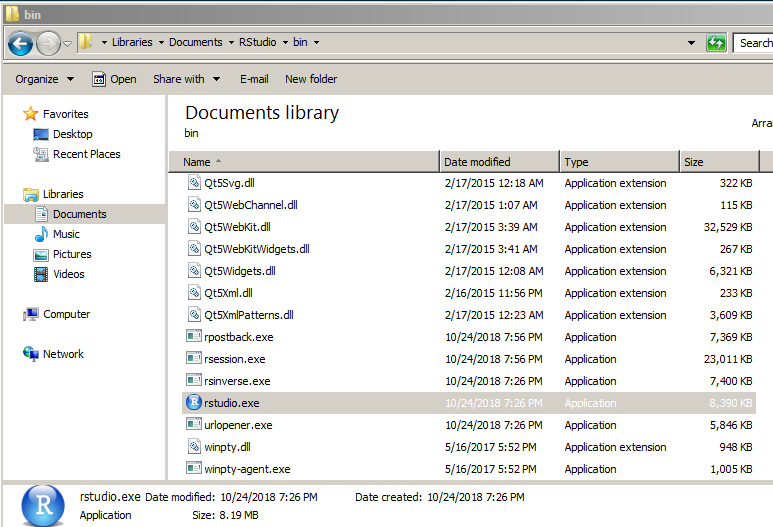
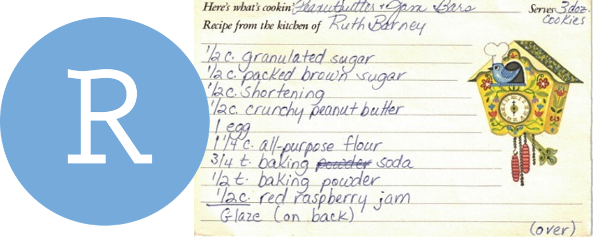
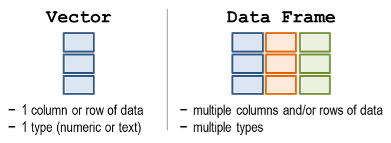
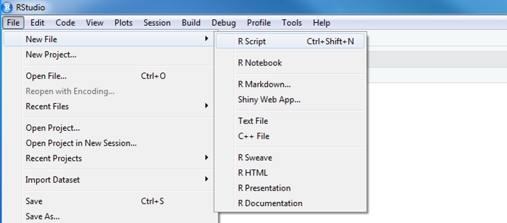
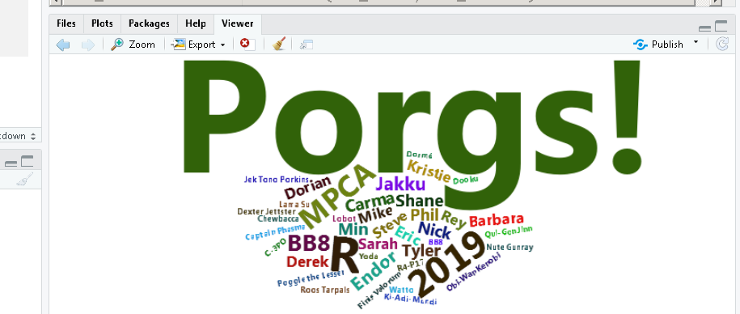

```{r setup, include=FALSE}
library("rmarkdown")
knitr::opts_chunk$set(echo = TRUE, error = TRUE)
htmltools::tagList(rmarkdown::html_dependency_font_awesome())
```


<div class="well">
<h1 style="margin-top: 7px; margin-bottom: 16px; font-size: 30px;"> Welcome! </h1>
_The <code style="color: hotpink;"> force </code> is strong with you. Join us, learn <code style="color: hotpink;">R</code>, and use your powers for good._
</div>

<br>


## Power on your droids {-}

{width="220" style="float: left; margin-right: 34px; margin-bottom: 28px; margin-top: 0px;"}

<br>

You and BB8 arrived just in time. Rey needs your help!

The Junk boss Unkar is up to no-good once again and Rey needs some parts to repair her starship. With your help she can escape Jakku and join forces with the New Republic.

<div style="clear: both;"></div>

<div class="well">

__Connect to your droid__

- Open the __Start menu__  _(the Windows logo on the bottom left of the screen)_
- Select ` Remote Desktop Connection ` _(you may need to search for it the 1st time)_
- Enter your desktop's ID: ` w7-your7digit# ` or ` R32-your7digit# `
- Press _Connect_

</div>


## Open _RStudio_ {-}

<div style="width: 48%; float: left; margin-right: 5%; margin-top: -14px;">

{style="width: 88%; margin-top: -35px; margin-bottom: -6px;"}

<br>

__Where's my R?__ _Do you need to install __R__ or __RStudio__? There's a nice workaround for you below._

</div>

<br>

{style="width: 34%; margin-top: -80px;"}

<div style="clear: both;"> <br> &nbsp; </div>

<details style="margin-top: -60px;">
<summary class="btn_code_blue" style="font-size: 17px;"> **Get R!** _(workaround)_ </summary>
<div class="note" style="margin-top: 0px; border-radius: 0;">
<p>

This is a temporary solution to get `R` + `RStudio` on your computer for the training.

### 1.	Open the R versions folder on the X-drive  {-}

- <code style="font-size: 76%;"> `\\pca.state.mn.us\xdrive\Agency_Files\Data_Services\DAU\Data Analytics User Group\Shared\r\versions` </code>

### 2.	Select and copy these 2 folders {-}

{style="margin-left: 7%; width: 74%"}


### 3. Open your _Documents_ folder  {-}

{style="margin-left: 7%; width: 74%"}

### 4. Paste in the copied folders {-}

{style="margin-left: 7%; width: 74%"}

<br>

### Test for success {-}

- Open `RStudio.exe` in the _RStudio\bin_ folder

{style="margin-left: 7%; width: 74%"}

<br>

- If you see the screen below - Great work!  You're ready to go.

{style="margin-left: 7%; width: 85%"}

</p></div></details>

<br>

__Still no R?__ _No worries. You can use R online at [RStudio Cloud](https://rstudio.cloud/)._


# Introductions {-}

{style="width: 90%; margin-left: 4%; margin-bottom: -10px; margin-top: -24px;"}

<br>

Let's introduce ourselves and the data we love. Find a __partner__ and get to know 3 things about them.

<br>

__Things to share__  

{align="right" style="width: 54%; margin-left: 26px; margin-top: 10px;"}

<div class="note" style="margin-top: -2px;">

- Your name or Star Wars alias 
- Types of data you have
- Who you share it with
- What you want to get from the workshop
- The messiest & funniest part of your data
- Something you get to do over and over again

__Hint:__ _Maybe this is something you can automate with R_ 

</div>

<br>

### What's my name? {-}

<div class="row3">

<div class="column4" style="border: 0;">

</div>

<div class="column4" style="border: 0;">

</div>

<div class="column4" style="border: 0;">

</div>

<div class="column4" style="border: 0;">

</div>

</div>

<br>

We are __Barbara__, __Kristie__, __Dorian__, and __Derek__. Yes, we look exactly like our profile photos above.   

We aren't computer scientists and that's okay! 

We make lots of mistakes. Mistakes are funny. You can laugh with us. 


# Why R? {-}
<hr>

{style="width: 95%;"}

## R Community {-}

- See the [R Community](https://itep-r.netlify.com/page/community.html) page.
- MPCA sharing + questions - [R questions](https://github.com/MPCA-air/R-questions) 
- Finding R Help - [Get Help!](help.html)
- R cheatsheets

## When do we use R? {-}

- To connect to databases
- To read data from websites
- To document and share methods
- When data will have frequent updates
- When we want to improve a process over time


## R is for reading {-}

{style="width: 55%; float: left; margin-right: 28px; margin-left: -16px;"}

Lucky for us, programming doesn't have to be a bunch of math equations. R allows you to write your data analysis in a step-by-step fashion, much like creating a recipe for cookies. And just like a recipe, we can start at the top and read our way down to the bottom. 

<div style="clear: both;"></div>

<br><hr>

<h2 style="font-size: 34px; margin-top: 12px;"> Blast off! </h2>

<hr>

# | RStudio - The grand tour 
<hr>

{style="width: 85%;"}

<br>


<div class="red-note">
__1 - Code Editor__ 

This is where you write your scripts and document your work. The tabs at the top of the code editor allow you to view scripts and data sets you have open. This is where you'll spend most of your time.
</div>

<div class="red-note">
__2 - R Console__ 

This is where code is actually executed by the computer. It shows code that you have run and any errors, warnings, or other messages resulting from that code. You can input code directly into the console and run it, but it won't be saved for later. That's why we like to run all of our code directly from a script in the code editor.
</div>

<div class="red-note">
__3 - Workspace__ 

This pane shows all of the objects and functions that you have created, as well as a history of the code you have run during your current session. The environment tab shows all of your objects and functions. The history tab shows the code you have run. Note the _broom_ icon below the Connections tab. This cleans shop and allows you to clear all of the objects in your workspace.
</div>

<div class="red-note">
__4 - Plots and files__ 

These tabs allow you to view and open files in your current directory, view plots and other visual objects like maps, view your installed packages and their functions, and access the help window. If at anytime you're unsure what a function does, enter it's name after a question mark. For example, try entering `?mean` into the console and push __ENTER__.
</div>


## Customize R Studio {-}

#### Make it your own {-}

Let's add a little style so R Studio feels like home. Follow these steps to change the font-size and and color scheme: 

1. Go to __Tools__ on the top navigation bar. 
2. Choose `Global Options...`
3. Choose `Appearance` with the paint bucket.
4. Increase the `Editor Font size`
5. Pick an Editor theme you like.
    - We'll be using `Dreamweaver` for the class


<br><br>

<div class="well">
Now that we're ready, let's go forth and make some trouble. While BB8 works on tracking down some data for us from his droid friends, we'll get to know our way around his internal computer. 
</div>

### Data awaits us... {-}

{style="width: 70%; margin-left: 10%;"}


## Start an R project {-}

Let's make a new project for our `Jakku` mischief.

__Step 1:__ Start a new project

- In _Rstudio_ select _File_ from the top menu bar
- Choose _New Project..._
- Choose _New Directory_
- Choose _New Project_
- Enter a project name such as `"starwars"`
- Select _Browse..._ and choose a folder where you normally perform your work. 
- Click _Create Project_

__Step 2:__ Open a new script 

- __File > New File > R Script__
- Click the _floppy disk_ save icon
- Give it a name: `jakku.R` or `lesson1.R` will work well


# | Names and things
<hr>

You can assign values to new objects using the "left arrow" `<- `, which is written by typing a less-than sign followed by a hyphen. It's more officially known as the _assignment operator_. Try adding the code below to your R script to assign a value to an object called `droid`.

To run a line of code in your script, move the cursor to that line and press __CTRL+ENTER__.

## Assignment operator {-}
```{r names, eval = F}
# Create a new object
droid <- "bb8"

droid 

wookie <- "Chewbacca"

wookie

```

<br>

__Break some things__
```{r, error=T}
# To save text to a character object you need quotation marks: "text"

# Try this:
wookie <- Chewbacca
```


<div class="red-note" style="width: 63%;">
__ERROR__

Without quotes, R looks for an object called Chewbacca, and then lets you know that it couldn't find one. 
</div>

<br>

__Copy objects__
```{r names2, eval=F}
# To copy an object, assign it to a new name
wookie2 <- wookie


# Or overwrite an object with new "text"
wookie <- "Tarfful"
  
wookie


# Did this change the value stored in wookie2?
wookie2  

```


<br>

## Drop and remove data {-}

You can drop objects with the remove function `rm() `. Try it out on some of your wookies.

```{r, eval = F}

# Delete objects to clean-up your environment
rm(wookie)

rm(wookie2)
```


<div class="tip">
### <i class="fa fa-user-astronaut" aria-hidden="true" style="color: green"></i> Exercise! {-}

How can we get the 'wookie' object back?

__HINT:__ The UP arrow in the Console is your friend.
</div>


<br>


<details>
<summary class = "btn_code_blue"> **EXPLORE: ** Deleting data is okay </summary>
<div class="note">
<p>
Don't worry about deleting data or objects in R. You can always recreate them! When R loads data files it copies the contents and cuts off any connection to the original data. So your original data files remain safe and won't suffer any accidental changes. That means if something disappears or goes wrong in R, it's okay. We can always reload the data using our script. 
</div>
</p></details>


## What's a good name? {-}

Everything has a name in R and you can name things almost anything you like. You can even name your data `TOP_SECRET_shhhhhh...` or `Luke_I_am_your_father` or `data_McData_face`.

Sadly, there are a _few_ minor restrictions. Names cannot include spaces or special characters that might be found in math equations, like `+`, `-`, `*`, `\`, `/`, `=`, `!`, or `)`. 

<br>

<div class="tip">
### <i class="fa fa-user-astronaut" aria-hidden="true" style="color: green"></i> Exercise! {-}

Try running some of these examples. Find new ways to create errors. The more broken the better! Half of learning R is finding what doesn't work.

```{r, eval = F}

n wookies <- 5

n*wookies <- 5

n_wookies <- 5

n.wookies <- 5


all_the_wookies! <- "Everyone on Kashyyyk"

```
</div>

<br>

<div class="tip">
```{r, eval = F}
# You can add one wookie
n_wookies <- n_wookies + 1


# But what if you have 10,000 wookies?
n_wookies <- 10,000


# They also cannot begin with a number.
1st_wookie <- "Chewbacca"

88b <- "droid"

# But they can contain numbers!
wookie1    <- "Chewbacca"

bb8 <- "droid"
```
</div>

<br>


<details>
<summary class = "btn_code_blue"> __EXPLORE:__ What happens when we re-created __n_wookies__ the 2nd time? </summary>
<p>

> When we create a new object with the same name as something that already exists, the new object replaces the old one. Sometimes we want to update an existing object and replace the old version. Other times we may want to copy an object to a new name to preserve the original. 
>
> This is similar to choosing between `Save` and `Save As` when saving a file.
>

</p></details>

## Multiple items {-}

We can add multiple values inside `c()` to make a vector of items. It's like a chain of items, where each additional item is connected by a comma. The `c` stands for to concatenate or to combine values into a vector.
  
Let's use `c()` to create a few vectors of names.

```{r vectors}

# Create a character vector and name it starwars_characters
starwars_characters <- c("Luke", "Leia", "Han Solo")

# Print starwars_characters to the console
starwars_characters

# Create a numeric vector and name it starwars_ages
starwars_ages  <- c(19,19,25)

# Print the ages to the console
starwars_ages
```


## Make a table {-}

A table in R is known as a __data frame__. We can think of it as a group of columns, where each column is made from a vector. Data frames in R have columns of data that are all the same length. 

{width="510" style="margin-left: 100px;"}

<br>


Let's make a table with 2 columns to hold the character names and their ages.
```{r table}

# Create table with columns "character" and "ages" with values from the starwars_names and starwars_ages vectors
starwars_df <- data.frame(character = starwars_characters,
                          ages  = starwars_ages)

# Print the starwars_df data frame to the console
starwars_df

```


<br>

### <i class="fa fa-bicycle" aria-hidden="true" style="color: green"></i> Exercise {-}  

```{r exer-tabs, results='asis', echo=F}
source("insert_tabs.R")

tabs <- c("Add a column", "Show hint", "Show code")

content <- c(Exercise = '<h4> Create the same table above, but add a __3rd__ column that lists their father names: </h4>

- `c("Darth", "Darth", "Unknown") ` 

<br>',

show_hint = 'code_start

starwars_df <- data.frame(character   = starwars_characters, 
                          ages        = starwars_ages, 
                          fathers     = __________________)
code_end',

show_code = 'code_start

starwars_df <- data.frame(character   = starwars_characters, 
                          ages        = starwars_ages, 
                          fathers     = c("Darth", "Darth", "Unknown"))
code_end')

tab_html <- add_tabs(tabs, content)

cat(paste0(tab_html, collapse = "\n"))
```


<br>

## Show all values in a `$column_name`  {-}

Use the `$` sign after the name of your table to see the values in one of your columns.

```{r columns}

# View the "ages" column in starwars_df
starwars_df$ages

```


<div class="quiz">

### Pop Quiz, hotshot! {-}

__Which of these object names are valid?__ _(Hint: You can test them.)_

<input type="radio"> _my starwars fandom_  <br> 
<input type="radio"> _my_wookies55_        <br> 
<input type="radio"> _5wookies_            <br> 
<input type="radio"> _my-wookie_           <br> 
<input type="radio"> _Wookies!!!_          <br>

<br>

<details>
<summary class = "btn_code">_Show solution_</summary>

<p>
<i class="fa fa-check" aria-hidden="true" style="color: green;"></i> `my_wookies55`  

_Yes!! The FORCE is strong with you!_

</p>
</details></div>

<div style="clear: both;"> </div>

## Leave a `#comment` {-}

The lines of code in the scripts that start with a `#` in front are called comments. Every line that starts with a `#` is ignored and won't be run as R code. You can use the `#` to add notes in your script to make it easier for others and yourself to understand what is happening and why. You can also use comments to add warnings or instructions for others using your code.


# | Read data
<hr>

The first step of a good scrap audit is reading in some data to figure out where all the scrap is coming from. Here is a small dataset showing the scrap economy on Jakku. It was salvaged from a crash site, but the transfer was incomplete.

```{r ex-data1, echo=F, message=F, warning=F}
library(readr)
library(tibble)
library(knitr)

options(scipen = 999)

scrap <- data.frame(origin      = c("Outskirts", "Niima Outpost", "Cratertown", "Tro----"), 
                    destination = c("Raiders", "Trade caravan", "Plutt", "Ta----"), 
                    item        = c("Bulkhead", "Hull panels", "Hyperdrives", "So---*"), 
                    amount      = c(332, 1120, 45, 1), 
                    price_d     = c("300", "286", "45", "10----"))

kable(scrap)
```


This looks like it could be useful. Now, if only we had some more data to work with...

## New Message _(1)_ {-}

<details>
<summary class = "btn_code_green">_Incoming..._ _BB8_</summary>
<p>

<div class="tip">
__BB8:__ _Beep boop Beep._

__BB8:__ _I intercepted a large scrapper data set from droid 4P-L of Junk Boss Plutt._   

<br>

Receiving data now...

<br>

__scrap_records.csv__ 

```{r, eval=F}
item,origin,destination,amount,units,price_per_pound  
Flight recorder,Outskirts,Niima Outpost,887,Tons,590.93  
Proximity sensor,Outskirts,Raiders,7081,Tons,1229.03  
Aural sensor,Tuanul,Raiders,707,Tons,145.27  
Electromagnetic filter,Tuanul,Niima Outpost,107,Tons,188.2  
...  
```

<br>

__You:__ _Yikes! This looks like a mess! What can I do with this?_

</div>
</p></details>


## CSV to the rescue {-}

The main data format used in R is the __CSV__ _(comma-separated values)_. A __CSV__ is a simple text file that can be opened in R and most other stats software, including Excel. It looks squished together as plain text, but that's okay! When opened in R, the text becomes a familiar looking table with columns and rows. 

Before we launch ahead, let's add a _package_ to R that will help us read __CSV__ files.

<br>

<details><summary class = "btn_code_blue"> How to save a CSV from Excel </summary>

<div class="note">
<p>

__Step 1:__ Open your Excel file.

__Step 2:__  Save as CSV

- Go to _File_  
- _Save As_  
- _Browse_ to your project folder  
- Save as type: _CSV (Comma Delimited) (*.csv)_  
    - Any of the _CSV_ options will work    
- Click __Yes__      
- Close Excel (Click "Don't Save" as much as you need to. Seriously, we just saved it. Why won't Excel just leave us alone?)   


Return to RStudio and open your project. Look at your _Files_ tab in the lower right window. Click on the _CSV_ file you saved and choose __View File__. Success!

<br>

<hr>
</p></div></details>

<br>


## &#x1F4E6; Add new packages {-}

> __What is an _R package_?__

A _package_ is a small add-on for R, it's like a phone App for your phone. They add capabilities like statistical functions, mapping powers, and special charts to R. In order to use a new package we first need to install it. Let's try it!


{align="left" width="145" style="margin-right:18px; margin-bottom: 12px;"}

<div style="margin-top: 32px;">

The _readr_ package helps import data into R in different formats. It helps you out by cleaning the data of extra white space and formatting tricky date formats automatically. 

</div>

<div style="clear: both;"> </div>


__Add a package to your library__  

1. Open _RStudio_ 
1. Type ` install.packages("readr") ` in the lower left console
1. Press Enter
1. _Wait two seconds_
1. Open the `Packages` tab in the lower right window of RStudio to see the packages in your _library_
    - Use the search bar to find the `readr` package

<br>

Your installed packages are stored in your R _library_. The `Packages` tab on the right shows all of the available packages installed in your library. When you want to use one of them, you load it in R. Loading a package is like opening an App on your phone. To load a package we use the `library()` function. Once you load it, the package will stay loaded until you close RStudio. 

Let's load the _readr_ package so we can use the `read_csv() ` function to read the Jakku scrap data.


## Read the data {-}

```{r starwars_read, eval = T}

library(readr)

read_csv("https://itep-r.netlify.com/data/starwars_scrap_jakku.csv")
```


## Name the data {-}

Where did the data go after you read it into R? When we want to work with the data in R, we need to give it a name with the assignment operator: `<-`. 

```{r starwars_csv_name, eval=T, message=F}

# Read in scrap data and set name to "scrap"
scrap <- read_csv("https://itep-r.netlify.com/data/starwars_scrap_jakku.csv")

# Type the name of the table to view it in the console
scrap

```

<br>


<div class="note">

### <i class="fas fa-user-astronaut" aria-hidden="true" style="color:#040707;"></i> Pro-tip! {-}

Notice the row of `<three>` letter abbreviations under the column names? These describe the data type of each column.

- `<chr>` stands for __character__ vector or a string of characters. Examples: _"apple"_, _"apple5"_, _"5 red apples"_  
- `<int>` stands for __integer__. Examples: _5_, _34_, _1071_  
- `<dbl>` stands for __double__. Examples: _5.0000_, _3.4E-6_, _10.7106_

We'll discover more data types later on, such as `dates` and `logical` (TRUE/FALSE).
</div>


<div class="quiz">

<h2 style="margin-top: 28px; margin-bottom: 44px;"> Pop Quiz! </h2>

__1. What data type is the `destination` column?__

<input type="radio"> _letters_        <br> 
<input type="radio"> _character_      <br> 
<input type="radio"> _TRUE/FALSE_     <br> 
<input type="radio"> _numbers_        <br> 

<details style="margin-left: 14px;">
<summary class = "btn_code">_Show solution_</summary>
<p>
<i class="fa fa-check" aria-hidden="true" style="color: green;"></i> `character`    
_Woop! You got this._
</p></details>

<br>
<hr style="margin-top: 8px;">

__2. What package does `read_csv()` come from?__

<input type="radio"> _dinosaur_     <br> 
<input type="radio"> _get_data_     <br> 
<input type="radio"> _readr_        <br> 
<input type="radio"> _dplyr_        <br> 

<details style="margin-left: 14px;">
<summary class = "btn_code">_Show solution_ </summary>
<p>

<i class="fa fa-check" aria-hidden="true" style="color: green;"></i> `readr`  
_Great job! You are Jedi worthy!_

</p></details>

<br>
<hr style="margin-top: 8px;">

__3. How would you load the package `junkfinder`?__

<input type="radio"> _junkfinder()_             <br> 
<input type="radio"> _library(junkfinder)_      <br> 
<input type="radio"> _load(junkfinder)_         <br> 
<input type="radio"> _gogo_gadget(junkfinder)_ <br> 

<details style="margin-left: 14px;">
<summary class = "btn_code">_Show solution_</summary>
<p>

<i class="fa fa-check" aria-hidden="true" style="color: green;"></i> `library("junkfinder")`  
_Excellent! Keep the streak going._

</p></details>

</div>

<br>

### {-}

<details>
<summary class="btn_code_blue"> __EXPLORE: Change a function's options__ </summary>

<div class="note" style="margin-top: -10px;">
<p>

Functions often have options that you can change to control their behavior. You can set these optins using _arguments_. Let's look at a few of the arguments for the function `read_csv()`.

<h3> Skip a row </h3>

Sometimes you may want to ignore the first row in your data file, especially an EPA file that includes a disclaimer on the first row. Yes EPA, we're looking at you. Please stop.

Let's open the help window with `?read_csv` and try to find an argument that can help us. There's a lot of them! But the `skip` argument looks like it could be helpful. Take a look at the description near the bottom. The default is `skip = 0`, which reads every line, but we can skip the first line by writing `skip = 1`. Let's give it a go.

```{r, eval = F}

read_csv("https://itep-r.netlify.com/data/starwars_scrap_jakku.csv", skip = 1)

```

<br>

<h3> Limit the total number of rows </h3>

Other types of data have weird last rows that are a _subtotal_ or just report "END OF DATA". Sometimes we want `read_csv` to ignore the last row, or only pull in a million lines because you don't want to bog down the memory on an old laptop. 

Let's look through the help window to find an argument that can help us. Type `?read_csv` and scroll down.

The `n_max` argument looks like it could be helpful. The default is `n_max = Inf`, which means it will read every line, but we can limit the lines we read to only one hundred by using `n_max = 100`.

```{r, eval = F}

# Read in 100 rows
small_data <- read_csv("https://itep-r.netlify.com/data/starwars_scrap_jakku.csv", skip = 1, n_max = 100)

# Remove the data
rm(small_data)

```

<br>

<h3> Show me the _arguments_! </h3>

__To see all of a function’s arguments__

- Enter its name in the console followed by a parenthesis: `read_csv( | `
- Press `TAB` on the keyboard
- This brings up a drop-down menu of the available arguments for that function 

</p></div></details>


# | ggplot2
<hr>

### _Plot the data, Plot the data, Plot the data_ {-}


{width="164" style="float: left; margin-right: 26px; margin-top: 10px;  margin-left: 0;"}

<br>

In data analysis it is really important to look at your data early and often. For that, let's add a new package called  __ggplot2__! 
<br><br>

Install it by running the following in your _Console_:

- `install.packages("ggplot2")`

<br><br>

<div class="note">
__NOTE__   

You can also install packages from the `Packages` tab in the lower right window of RStudio.

{style="width: 450px; height: 180px; margin-left: 10%;"}


</div>


## A column plot {-}
Here's a simple chart showing the total amount of scrap for each origin location.

```{r, fig.width=12}
library(ggplot2)

ggplot(scrap, aes(y = amount, x = origin)) + 
  geom_col() +
  theme_gray()

```

Well, well, well, it looks like there is an **All** category we should look into more. Either there is a town hogging all the scrap or the data needs some cleaning.

<div class="tip">

#### <i class="fa fa-bicycle" aria-hidden="true" style="color: darkgreen"></i> Exercise {-}

Try changing `theme_gray()` to `theme_dark()`. What changes on the chart? What stays the same?

Try another theme: `theme_classic()` or `theme_void()` or delete the entire line and the `+` above to see what the default settings are.

You can view all of the available theme options at [ggplot2 themes](https://ggplot2.tidyverse.org/reference/ggtheme.html).

</div>


# | <i class="far fa-question-circle" aria-hidden="true"></i> Get help
<hr>

Lost in an ERROR message? Is something behaving strangely and want to know why? 
See the [Help!](help.html) page for some troubleshooting options.


# | Operation Shut Down

When you close R for the first time you will see some options about saving your workspace and other files. In general, we advise against saving these files. It's easy enough to re-run your script next time you open your project. This will help RStudio open a fresh and clean environment every time you start it.

Follow these steps to set these options permanently.

__Turn off *Save Workspace* __

1. Go to ` Tools > Global Options.... `  on the top RStudio navigation bar
1. On the first screen:
    - [ ] Uncheck Restore .Rdata into workspace at startup
    - Set _Save workspace to .RData on exit_ to ["Never”].
    - [ ] Uncheck Always save history


<br>

### <i class="fa fa-hourglass-half" aria-hidden="true" style="color:#040707;"></i> __RECAP__ {-}

>
> - What packages have we added to our `library`?
>
> - What new functions have we learned?
>

<br>

<details>
<summary class = "btn_code_blue"> __REVIEW: Functions & arguments__ </summary>

<p>
<div class="well" style="background-color: lightblue; margin-top: -13px;">
_Functions_ perform steps based on inputs called _arguments_ and usually return an output object. There are _functions_ in R that are really complex but most boil down to the same general setup:

```{r, eval=F}
new_output <- function(argument_input1, argument_input2)
```

You can make your own functions in R and name them almost anything you like, even `my_amazing_starwars_function()`.

<br>


{width="220" style="float: left; margin-right: 36px; margin-top: -2px;"}

<br>

You can think of a _function_ like a plan for making Clone Troopers.

<br>

```{r, eval=F} 

create_clones(host       = "Jango Fett", 
              n_troopers = 2000)
```

<br>

The _function_ above creates Clone Troopers based on two _arguments_: the `host` and `n_troopers`. When we have more than one _argument_, we use a comma to separate them. With some luck, the function will successfully return a new object - a group of 2,000 Clone Troopers.

<div style="clear: both;"> </div>

__The `sum()` function__

We can use the `sum()` function to find the sum age of our Star Wars characters.

```{r}

# Call the sum function with starwars_ages as input
ages_sum <- sum(starwars_ages) # Assigns the output to starwars_ages_sum

# Print the starwars_ages_sum value to the console
ages_sum

```

<br>

The `sum()` function takes the _starwars_ages_ vector as input, performs a calculation, and returns a number. Note that we assigned the output to the name `ages_sum`. 

If we don't assign the output it will be printed to the console and not saved.

```{r}
# Alternative without assigning output
sum(starwars_ages) 
```

<br>

> __NOTE__ 
>
> The original `starwars_ages` vector has not changed. Each function has its own "environment" and its calculations happen inside a bubble. In general, what happens inside a function won't change your objects outside of the function. 


```{r}
starwars_ages
```

<br>
</div></p></details>


<br>

<details>
<summary class="btn_code_blue"> 
__EXPLORE:__ Does the order of arguments matter? </summary>

<div class="note" style="margin-top: -14px;">
<p>

You may be wondering why we included `skip =` for the skip argument, but tell R explicitly what argument the other objects belonged to. Well now, that's an interesting story. When you pass inputs to a function, R assumes you've entered them in the same order that is shown on the `?help` page. Let's say you had a function called `feed_porgs()` with 3 arguments:

- `feed_porgs(breakfast = "fish", lunch = "veggies", dinner = "clams")`.

A shorthand to write this would be:

- `feed_porgs("fish", "veggies", "clams")`. 

This works out just fine because all of the arguments were entered in the default order, the same as above.

<br>

But let's say we write: 

- `feed_porgs("veggies", "clams", "fish")`

Now the function will send _veggies_ to the porgs for breakfast because that is the first argument. But that's no good for the porgs. So if we really want to write _"veggies"_ first, we'll need to tell R which food item belongs to which meal. 

Like this:

- `feed_porgs(lunch = "veggies", breakfast = "fish", dinner = "clams")`.

<br>

__Ok, so what about `read_csv()`?__  

For `read_csv`, when we wrote:

- `read_csv(scrap_file, column_names, skip = 1)`

R assumes that the first argument (the data file) is `scrap_file` and that the 2nd argument "col_names" should be set to `column_names`. Next, the `skip =` argument is included explicitly because _skip_ is the __10th__ argument in `read_csv()`. If we didn't include `skip = `, R would assume the value `1` that we entered is meant for the function's __3rd__ argument. 

</p></div></details>

<br>


# <i class="fas fa-key fa-xs" style="color: #c81888;" aria-hidden="true"> </i> Key terms {-} 

|           |  |                                                                  |   
|-----------|--|:-----------------------------------------------------------------|  
|`package  `|  | An add-on for R that contains new functions that someone created to help you. It's like an App for R.  |  
|`library  `|  |The name of the folder that stores all your packages, and the function used to load a package.  |  
|`function  `|  | Functions perform an operation on your data and returns a result. The function `sum()` takes a series of values and returns the sum for you.  |  
|`argument  `|  | Arguments are options or inputs that you pass to a function to change how it behaves. The argument `skip = 1` tells the `read_csv()` function to ignore the first row when reading in a data file. To see the default values for a function you can type `?read_csv` in the console.  |  

<br>

<details>
<summary class = "btn_code" style="font-size: 15px;"> <i class="fa fa-star"></i> BONUS <i class="fa fa-star"></i> &nbsp; &nbsp; Build your own Word Cloud </summary>
<div class="quiz" style="margin-top: 0;">
<p>

Let's launch ourselves into the unknown and use R to make a `Word Cloud`. With a little copy-pasting we can make a fun image out of everyone's name in the class. 

Since you're such a big deal, we can also help you make your name really <span style="font-size: 26px;"> __BIG__ </span>.

<hr style="margin-top: 4px;">

<h3> INSTRUCTIONS </h3>

1. Open R Studio

2. Copy the code below into your script in RStudio. Start with the line `install.packages` and end with the line `color = 'random-dark')`.

```{r wordcloud, eval=F}
install.packages(c("wordcloud2", "dplyr"))
library(wordcloud2)
library(dplyr)

           #---- Class names ----# 
class <- c("Steve"    = 8, 
           "Mike"     = 9, 
           "Eric"     = 8, 
           "Hannah"   = 9, 
           "Jon"      = 8, 
           "Mary"     = 9, 
           "Min"      = 9, 
           "Aida"     = 9,
           "Matthias" = 8,
           "Gao"      = 9,
           "Ben"      = 9,
           "Eva"      = 9,
           "James"    = 10,
           "Kitty"    = 11,
           "Zeb"      = 9,
           #---- Fun names ----#
           "R"        = 26, 
           "2019"     = 20,
           "MPCA"     = 16,
           "Porgs!"    = 84,
           "Endor"     = 10,
           "Jakku"     = 10,
           "BB8"       = 12,
           "Rey"       = 8,
           "Derek"     = 8, 
           "Kristie"   = 8, 
           "Barbara"   = 8, 
           "Dorian"    = 8)

# Add 20 Star Wars names as small text, size = 4
class <- c(class, rep(4, 20))

names(class)[(length(class) - 19):length(class)] <- sample_n(starwars, 20)$name      

# Plot the Word Cloud with the "random-dark" color theme
wordcloud2(data.frame(word = names(class), freq = class), 
           size  = 1, 
           color = 'random-dark')

```

<br>

3. In R Studio click on __File > New File > R Script__. You will see a code editor window open. 

{style="width: 65%; margin-bottom: 18px;"}

4. Paste the copied code into the upper left hand window. This is your code editor.  
5. Highlight all of the code and hit `CTRL + ENTER`.
6. You should see a Word Cloud pop up in the lower right of RStudio.
7. Now try increasing the number next to your name.  
8. Run the code again.
    - You may need to increase the size of the `Viewer` window shown below to make enough room for your name to appear. You can also click the `Zoom` icon to create a bigger word cloud.
9. Make your name even __BIGGER!__
 

{width="75%"}

<br>

<div class="tip" style="margin-top: 12px; padding-top: 0px; padding-bottom: 4px;">
<h3> Congrats rebel droid! <i class="fa fa-android" style="font-size: 44px;"></i>  </h3>

</div>

</p></div></details>

<br>

# <i class="fa fa-rocket" aria-hidden="true"></i> Return to [Homebase](index.html) {-}

<br>
