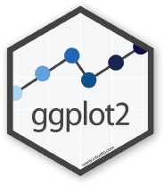

```{r setup, include=F}
knitr::opts_chunk$set(echo = TRUE, warning = F, message = F)
knitr::opts_chunk$set(fig.width = 11, fig.height = 6) 
htmltools::tagList(rmarkdown::html_dependency_font_awesome())

library(readr)

scrap <- read_csv("https://itep-r.netlify.com/data/starwars_scrap_jakku_full.csv")
```

# Welcome back Jedis! {-}
<hr>

{width="260" style="float: left; margin-right: 60px; margin-top: 8px;"}

<br>

### Please connect to your droid {-}

- Open the __Start menu__  (_Click the Windows logo on the bottom left of the screen_)
- Select ` Remote Desktop Connection `
- Enter ` R32-your7digit# ` or ` w7-your7digit# `
- Press _Connect_

<br>

__Open your RStudio project__

- __Open__ your project folder from last week
- Double click the __.Rproj__ file to open RStudio

__Open a New script__

- __File > New File > R Script__

- Click the _floppy disk_ save icon
- Give it a name: `04_day.R` will work well


## Schedule  {-}

<div class="well">

- Review
- - Conditional mutate
    - `ifelse()`
    - Yes/No decisions
- Summarize by group
- More plots
    - New geoms
    - Reference lines
    - Faceting
    - Colors
    - Titles 
    
</div>   
    

## Porg review {-}

The _poggle_ of porgs has returned to help us review the `dplyr` functions. Follow along by downloading the __porg__ data from the URL below.

```{r, eval = F}
library(readr)
porgs <- read_csv("https://itep-r.netlify.com/data/porg_data.csv")
```

<br>

```{r porg-tabs, results='asis', echo=F}
cat(readLines("porg_tabs.txt"))
```

<br>


# | Reload the _scrap_ data


```{r, echo=T}
library(readr)
library(dplyr)

# Read in the conversion data
convert <- read_csv("https://rtrain.netlify.com/data/conversion_table.csv")

# Read in scrap data
scrap <- read_csv("https://itep-r.netlify.com/data/starwars_scrap_jakku_full.csv")

# Join the scrap to the conversion table
scrap <- left_join(scrap, convert)

# Calculate the total price
scrap <- scrap %>% 
         mutate(total_pounds = amount * pounds_per_unit,
                credits      = total_pounds * price_per_pound)

# Calculate the price per unit
scrap <- scrap %>% 
         mutate(price_per_unit = credits / amount)

```


# | `ifelse()`

### `[If this thing is true]`, `"Do this"`, `"Otherwise do this"` {-}

<br>


{style="width: 46%; margin-left: 26.5%; margin-top: -8px; margin-bottom: 12px;"}

<br>

Here's a handy `ifelse` statement to help you identify lightsabers.

<div class="well" style="margin-top: 10px:">
`ifelse( `__Is lightsaber__ <span style="color: green;">__GREEN__?</span>, __Yes!__ ` Then it's Yoda's,` __No!__ ` Then it's not Yoda's)`

</div>

<br>

Say you want to label all the porgs over _60 cm_ as tall, and everyone else as short. In other words, we want to add a column where the value depends on the value found in the height column. We use `ifelse()` for this.

Or maybe you have a list of prices for scrap, and you want to flag only the ones that cost less than 500 credits. 

## `mutate()` + `ifelse()` is powerful! {-}

{style="width: 74%; margin-left: 12%"}

<br>


### On the cheap {-}

Bad news. We're on a budget people. Rey can't afford anything over 500 credits per item. 

Let's add a column that labels the items as "Cheap" __if__ the price is less than 500.

__Add an affordable column__
```{r ifelse, message=F, warning=F}
library(dplyr)
library(readr)

# Add an affordable column
scrap <- scrap %>% 
         mutate(affordable = ifelse(price_per_unit < 500, "Cheap", "Expensive"))

```


<div class="tip">

#### <i class="fa fa-cogs" aria-hidden="true" style="color: green"></i> EXERCISE {-}

Use `filter()` to create a new `cheap_scrap` table.

</div>


<div class="quiz">
### Pop Quiz! {-}

__What is the cheapest item?__

<input type="radio"> _Black box_         <br> 
<input type="radio"> _Electrotelescope_  <br> 
<input type="radio"> _Atomic drive_      <br> 
<input type="radio"> _Enviro filter_     <br> 
<input type="radio"> _Main drive_        <br>
<br>

<details>
<summary class = "btn_code">_Show solution_</summary>

<p>
<i class="fa fa-check" aria-hidden="true" style="color: green;"></i> `Black box`  

_You win! _

</p>
</details></div>


<br>

> __CONGRATULATIONS__ of galactic proportions to you. 
>
>We now have a clean and tidy data set. If BB8 receives new data to append, we can re-run this script and in 5 seconds we'll have cleaned up data again!
>

<br>

# | Plots with _ggplot2_
<hr>

#### _Plot the data, Plot the data, Plot the data_ {-}

<br>

{align="right" width="180" style="margin-right: 70px; margin-top: -124px;"}


## The `ggplot()` sandwich {-}


{style="margin-top: -22px; margin-left: -40px; max-width: 110%;"}

<h5 style="font-size: 28px; font-weight: bold; margin-top: -42px;"> A `ggplot` has 3 ingredients. </h5>


## 1. The base plot {-}
```{r, echo = T, eval = T}
library(ggplot2)
```


```{r, echo=T, eval=T}
ggplot(scrap)
```

<br>

> we load the package `library (ggplot2)`, but the function to make a plot is `ggplot(scrap)`. 


## 2. The the X, Y _aesthetics_  {-}

The _aesthetics_ assign the components from the data that you want to use in the chart. These also determine the dimensions of the plot.

```{r, eval = T}
ggplot(scrap, aes(x = origin, y = credits)) 
```


## 3. The layers or _geometries_  {-}
```{r, eval = T}
ggplot(scrap, aes(x = origin, y = credits)) + geom_point()
```

<br>

<div class="tip">
#### <i class="fa fa-cogs" aria-hidden="true" style="color: green"></i> EXERCISE {-}

Try making a scatterplot of any two columns.

_Hint: Numeric variables will be more informative._

```{r, eval = F, echo = T}
ggplot(scrap, aes(x = column1, y = column2 )) + geom_point()
```
</div>


## Colors {-}
<hr>


Now let's use color to show the destination of the scrap
```{r, eval = T}
ggplot(scrap, aes(x = origin, y = credits, color = destination)) +
  geom_point()
```


## Columns charts {-}

Yikes! That point chart had too much detail. Let's make a column chart and add up the sales to make it easier to understand. Note that we used `fill =` instead of `color =`. Try using color instead and see what happens.


```{r, eval = T, echo = T}
ggplot(scrap, aes(x = origin, y = credits, fill = destination)) +
  geom_col()
```

<br>

We can change the position of the bars to make it easier to compare sales by destination for each origin. For that we'll use the -- _drum roll please_ -- `position` argument. Remember, you can use `help(geom_col)` to learn about the different options for that type of plot. 

```{r, eval = T, echo = T}
ggplot(scrap, aes(x = origin, y = credits, fill = destination)) +
  geom_col(position = "dodge")
```


<div class="tip">

### <i class="fa fa-user-bicycle" aria-hidden="true" style="color:#040707;"></i> EXERCISE {-}

An easy way to experiment with colors is to add layers like `+ scale_fill_viridis()` or `+ scale_fill_brewer()` to your plot, which will link to RcolorBrewer so you can have accessible color schemes.

Try adding one of thse to your column plot above.

</div>


## Facet wrap {-}

Does the chart feel crowded to you? Let's use `facet wrap` to put each origin in a separate chart.

```{r, eval = T, echo = T}
ggplot(scrap, aes(x = origin, y = credits, fill = destination)) +
  geom_col(position = "dodge") +
  facet_wrap("destination")
```


# It's Finn time {-}

Seriously, let's pay that ransom already. 

> __Where should we go to get our 10,000 Black boxes?__

<br>

__Step 1:__ Filter the scrap data to only `Black box`.

```{r, eval=F}
cheap_scrap <- filter(scrap, ______    ==   _____   )

```

```{r, echo=F}
cheap_scrap <- filter(scrap,item    ==   "Black box"  )
```

<br>

__Step 2:__ Make a `geom_col()` plot of the total pounds of Black boxes shipped to each destination. 

```{r, eval=F}

ggplot(cheap_scrap, aes(x =   , y =    ) ) + 
   geom_

```

<details>
<summary class = "btn_code">_Show code_</summary>

<div class="quiz" style="margin-top: -9px;">
<p>

```{r}
ggplot(cheap_scrap, aes(x = destination, y = total_pounds) ) + 
   geom_col()

```

</p></div></details>


<div class="quiz">
### Pop Quiz! {-}

__Which destination has the most pounds of the cheapest item?__

<input type="radio"> _Trade caravan_  <br> 
<input type="radio"> _Niima Outpost_  <br> 
<input type="radio"> _Raiders_        <br> 
<br>

<details>
<summary class = "btn_code">_Show solution_</summary>

<p>
<i class="fa fa-check" aria-hidden="true" style="color: green;"></i> `Raiders`  

_Woop! Go get em! So long Jakku - see you never!_

</p>
</details></div>


<br><br>


# <i class="fa fa-star" aria-hidden="true" style="color: gold"></i> CONCATULATIONS! <i class="fa fa-star" aria-hidden="true" style="color: gold"></i> {-}
<hr>

> __Clap your hands. You have earned a great award.__


<br>


# | Plot extras
<hr>

## Themes {-}

Want to shake up the appearance of your plots? `ggplot2` uses `theme` functions to change the general appearance of a plot. Try some different themes out. Here's `theme_dark()`.

```{r, eval = T, echo = T}
ggplot(scrap, aes(x = origin, y = credits, fill = destination)) +
  geom_col(position = "dodge") +
  facet_wrap("destination") +
  theme_dark()
```


## Labels {-}

You can set the axis and title labels using the `labs` function.

```{r, eval = T, echo = T}
ggplot(scrap, aes(x = origin, y = credits, fill = destination)) +
  geom_col(position = "dodge") +
  facet_wrap("destination") +
  labs(title    = "Scrap sales by origin and destination", 
       subtitle = "Planet Jakku",
       x        = "Origin", 
       y        = "Total sales",
       caption  = "Data gracefully provided by BB8")
```

<br>


## Drop ` 1.0e+10` scientific notation {-}

Is your boss scared of scientific notation? To hide it we can use `options(scipen = 999)`. Note that this is a general setting in R. Once you use `options(scipen = 999)` in your current session you won't have to use it again. Like loading a package, you only need to run the line once when you start RStudio.

<br>

```{r, eval = T, echo = T}
options(scipen = 999)

ggplot(scrap, aes(x = origin, y = credits, fill = destination)) +
  geom_col(position = "dodge") +
  facet_wrap("destination") +
  theme_bw() +
  labs(title = "Scrap sales by origin and destination", 
       x     = "Origin", 
       y     = "Total sales")
```

<br>

<div class="note">
__CHALLENGE__

Let's say we don't like printing so many zeros and want the labels to be in __Millions__ of credits. How can you make it happen?

<br>

<details><summary> [Click here for a HINT] </summary>
<p>

_Sorry, the hint is missing. You're on your own._

</p>
</details>

</div>


<br>


<div class="tip">

### <i class="fa fa-bicycle" aria-hidden="true" style="color: green"></i> EXERCISE {-}

Be brave and make a boxplot. We've covered how to do a scatterplot with `geom_point` and a bar chart with `geom_col`, but how would you make a boxplot showing the prices at each destination? You're on your own here. Feel free to add `color` ,`facet_wrap`, `theme`, and `labs` to your boxplots. 

_May the force be with you._
</div>


## Save plots {-}

You've hopefully made some plots you're proud of, so let's learn to save them so we can cherish them forever. There's a function called `ggsave` to do just that. How do we `ggsave` our plots? HELP! Let's type `help(ggsave)`.

```{r ggsave, eval = F, echo = T}
# Get help
help(ggsave)
?ggsave

# Copy and paste the r code of your favorite plot here
ggplot(data, aes()) +
   .... +
   ....


# Save your plot to a png file of your choosing
ggsave("your_results_folder/plot_name.png")
```


<br>


### <i class="fa fa-user-astronaut" aria-hidden="true" style="color:#040707;"></i> Pro-tip! {-}
<div class="note">

Sometimes you may want to make a plot and save it for later. For that, you give your plot a name. Any name will do.

```{r ggsave-objects, eval = F, echo = T}

# The ggplot you want to save
my_plot <- ggplot(...)
  
# The name of the file the chart will be saved to.
where_to_save_it <- "___.png"

# Save it!
ggsave(filename = where_to_save_it, plot = my_plot)
```

<br>

_Learn more about saving plots at_ [http://stat545.com/](http://stat545.com/block017_write-figure-to-file.html)

<br>

</div>


# | Glossary

__Table of `aesthetics`__

| aes()         |    
|:--------------|  
| `x = `        |     
| `y = `        |      
| `alpha = `    |     
| `fill = `     |      
| `color = `    |    
| `size = `     |     
| `linetype = ` |      


<br>

__Table of `geoms`__


<br>

__Table of `themes`__

You can customize the look of your plot by adding a `theme()` function.


# Homeworld training {-}

{style="float: right; margin-top: -34px;"}

1. Load one of the data sets below into R
    - Porg contamination on Ahch-To
        - `https://rtrain.netlify.com/data/porg_samples.csv`
    - Planet Endor air samples
        - `https://rtrain.netlify.com/data/air_endor.csv`
    - Or use data from a recent project of yours   


2. Create 2 plots using the data.


3. _If you make something really_ __strange__. _Feel free to share! Consider it art and keep going._ 


<div class="note">

### <i class="fa fa-user-astronaut" aria-hidden="true" style="color:#040707;"></i> Pro-tip! {-}

When you add more layers using `+` remember to place it at the end of each line.

```{r, eval=F, echo=T}
# This will work
ggplot(scrap, aes(x = origin, y = credits)) +
  geom_point()

# So will this
ggplot(scrap, aes(x = origin, y = credits)) + geom_point()

# But this won't
ggplot(scrap, aes(x = origin, y = credits))
  + geom_point()

```

</div>

<br><br>

<details>
<summary class = "btn_code"><h4> <i class="far fa-question-circle" aria-hidden="true"></i> Plots Q+A </h4> </summary>
<div class="quiz" style="margin-top: -9px; background-color: white; font-size: 16px;">
<p>
<br>

- How to modify the gridlines behind your chart?
    - Try the different themes at the end of this lesson: `theme_light()` or `theme_bw()`
    - Or modify the color and size with `theme(panel.grid.minor = element_line(colour = "white", size = 0.5))`
    - There's even `theme_excel()`
- How do you set the x and y scale manually?
    - Here is an example with a scatter plot: `ggplot() + geom_point() + xlim(beginning, end) + ylim(beginning, end)`
    - __Warning:__ Values above or below the limits you set will not be shown. This is another great way to lie with data. 
- How do you get rid of the legend if you don't need it?
    - `geom_point(aes(color = facility_name), show.legend = FALSE)`
    - The [R Cookbook](http://www.cookbook-r.com/Graphs/Legends_(ggplot2)/) shows a number of ways to get rid of legends.
- I only like dashed lines. How do you change the linetype to a _dashed_ line? 
    - `geom_line(aes(color = facility_name), linetype = "dashed")`
    - You can also try `"dotted"` and `"dotdash"`, or even`"twodash"`
  
- How many colors are there in R? How does R know `hotpink` is a color?
    - There is an [R color cheatsheet](https://www.nceas.ucsb.edu/~frazier/RSpatialGuides/colorPaletteCheatsheet.pdf)  
    - As well as a list of [R color names](http://www.r-graph-gallery.com/42-colors-names/)
    - `library(viridis)` provides some great default color palettes for charts and maps.
    - This [Color web tool](http://colorbrewer2.org/#type=sequential&scheme=BuGn&n=3) has palette ideas and color codes you can use in your plots
- Keyboard shortcuts for RStudio
    - There is a [Shortcut cheatsheet](https://www.rstudio.com/wp-content/uploads/2016/01/rstudio-IDE-cheatsheet.pdf)
    - In RStudio you can go to _Help_ > _Keyboard Shortcuts Help_

</p>
</div></details>


<br>

# <i class="fa fa-rocket" aria-hidden="true"></i> Return to [Homebase](index.html) {-}

<br>


