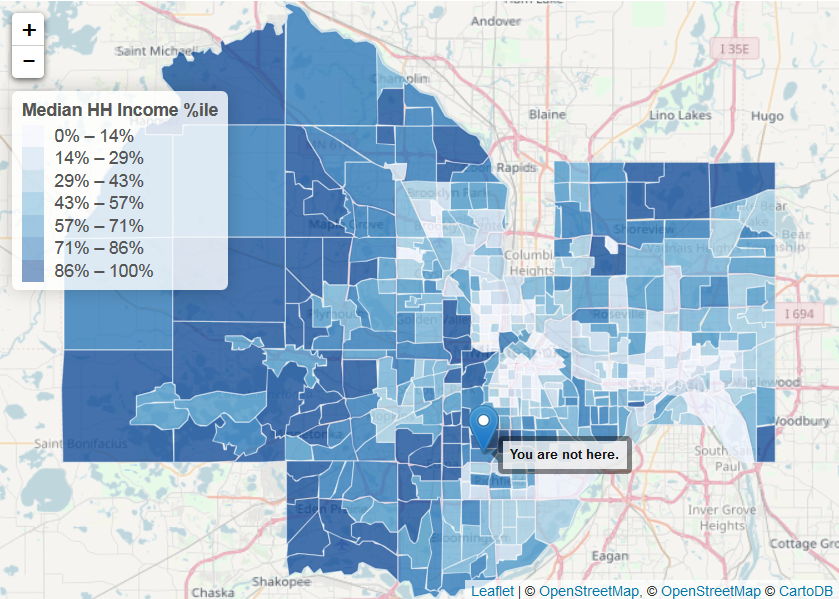
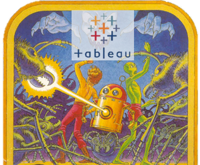

  
<style> code {color: #535353 !important;} </style>
      
```{r setup, include=FALSE}
library(rmarkdown)
knitr::opts_chunk$set(echo = F, error = F, message = F, warning = F)
htmltools::tagList(rmarkdown::html_dependency_font_awesome())
```
 

## Get R!
<hr>

Go to — [Install R](https://itep-r.netlify.com/page/install.html) — to get the latest version of R and RStudio.  

<br>  
  
#### Updates

Go to — [Update R](https://itep-r.netlify.com/page/install.html#update-r) — if you already have R but haven't used it in awhile.  
  
    
## Intro to R
<hr>

This series teaches the basics of importing data, using new packages, cleaning and summarizing data with __tidy__ tools, and using `ggplot2` to make charts, maps and other data visualizations. 

<div class="row3" style = "margin-top: 20px;">

<div class="column3"><a href="01-Day1.html"><span style="margin-left: 32%;"><i class="fa fa-star" aria-hidden="true" style="color: #f17405;"></i> 
__Day 1__ 
<i class="fa fa-star" aria-hidden="true" style="color: #f17405;"></i></span></a></div>

<div class="column3"> <a href="02_Day2.html"><span style="margin-left: 32%;><i class="fa fa-star" aria-hidden="true" style="color: #2a5ea9;"></i> 
__Day 2__ 
<i class="fa fa-star" aria-hidden="true" style="color: #2a5ea9;"></i></span></a></div> 

<div class="column3"> <a href="03_Day3.html"><span style="margin-left: 32%;><i class="fa fa-star" aria-hidden="true" style="color: #fa970c;"></i> 
__Day 3__ 
<i class="fa fa-star" aria-hidden="true" style="color: #fa970c;"></i></span></a></div>

</div>

<div class="row3">

<div class="column3" style="border: 1px solid grey; height: 270px; max-height: 270px;">
<a href="01-Day1.html"></a>
</div>


<div class="column3" style="border: 1px solid grey; height: 270px; max-height: 270px;">
<a href="02_Day2.html"></a>
</div>


<div class="column3" style="border: 1px solid grey; height: 270px; max-height: 270px;">
<a href="03_Day3.html"></a>
</div>

</div>


<div class="row3" style = "margin-top: 30px;">
<div class="column3-txt">

1. Become a a young Jedi scrap scavenger
1. __Project__ launch
    - Create a new project and R script
    - Install R packages
    - Create variables, lists, data frames
1. __Read data__ into R
    - Arrange, select and __filter__ data 
    - Look for errors and outliers
1. Plot the data!

Packages: `readr`, `dplyr`  
Planets visited: `Jakku`


</div>

<div class="column3-txt">

1. Data cleaning
1. Data transformations
    - Add __new columns__ and convert units
    - Summarize data
    - Save data
1. Group the data
    - Answers for each group and category
1. Working with __Dates__
1. More __plots__!

Packages: `dplyr`, `lubridate`,   
Planets visited: `Endor`  

</div> 

<div class="column3-txt">

1. Make __plots__
1. Join tables
1. `ifelse()` do this
1. More __plots__
    - Scatter plots `+` box plots
    - Trend lines
    - Add titles, colors, and labels
    - Reference lines
1. Save plots 
1. __Your data__
    - Connect to databases
    - Tidy your data
    - Map your data


Packages: `ggplot2`, `readxl` 
Planets visited: `Ahch-To` 

</div>
</div>
 
 
## Workshops
<hr>

Each of these workshops dives into more detail on a common data anlaysis task. 

<div class="row3" style = "margin-top: 20px;">

<div class="column3">
<a href="01-workshop_tidy.html">
<span style="margin-left: 25%;"><i class="fa fa-cogs" aria-hidden="true" style="color: gray;"></i> 
Messy data 
<i class="fa fa-cogs" aria-hidden="true" style="color: gray;"></i> 
</span>
</a></div>

<div class="column3"><span style="margin-left: 33%;"><a href="https://mpca-air.github.io/RCamp/03-Day3_db_connect.html">
Databases </a>
</span></div> 

<div class="column3"><span style="margin-left: 24%;"> <a href="https://mpca-air.github.io/RCamp/03-Day3_GIS.html">
Maps and shapefiles </a>
</span></div>
</div>


<div class = "row3">

<div class = "column3" style="height: 190px; max-height: 190px; width: 275px; max-width: 275px; border: 1px solid grey; overflow: hidden;">

<div style="height: 190px; max-height: 190px; width: 275px; max-width: 275px; position: relative;">

<a href="https://mpca-air.github.io/RCamp/01-workshop_tidy.html">

</a>

</div></div>

<div class = "column3" style="height: 190px; max-height: 190px; width: 275px; max-width: 275px; border: 0px solid grey; overflow: hidden;">
<div style="height: 190px; max-height: 190px; width: 275px; max-width: 275px; position: relative;">
<a href="https://mpca-air.github.io/RCamp/03-Day3_db_connect.html">

</a>
</div></div>


<div class = "column3" style="height: 190px; max-height: 190px; width: 275px; max-width: 275px; border: 1px solid grey; overflow: hidden;">
<div style="height: 190px; max-height: 190px; width: 275px; max-width: 275px; position: relative;">
<a href="https://mpca-air.github.io/RCamp/03-Day3_GIS.html">

</a>
</div></div>

</div>


<div class="row3" style="margin-top: 30px;">
<div class="column3">

1. Collapse data spread across many columns
1. Read an entire folder of files and combine into 1 table
1. Order plots from highest to lowest
1. Parse __dates__ into seasons, months, quarters, or day of the year

Packages: `tidyr`, `readxl`, `lubridate`, `forcats`

</div>


<div class="column3">

1. Connect to Oracle databases 
    - `DELTA` / `TEMPO`
1. Explore datbase tables
1. Read data from different _schemas_
1. Join tables

Packages: `RODBC`, `dplyr`

</div>


<div class="column3">

1. Read and save shapefiles
1. Convert coordinate projections (ex. `Lat/Long` to `UTM`)
1. Load reference maps 
    - States, counties, ZIP Codes
1. Build interactive maps


Packages: `leaflet`, `sf`, `tidycensus`, `tigris`

</div></div>


<br>


<div class="row3" style = "margin-top: 20px;">

<div class="column3">
<a href="03-Day3_web_data.html">
<span style="margin-left: 35%;"> <a href="https://mpca-air.github.io/RCamp/03-Day3_web_data.html">
Web data </a>
</span>
</a></div>

<div class="column3"><span style="margin-left: 10%;">
<a href="https://mpca-air.github.io/RCamp/03-Day3_other_stats.html">
Talking to SAS & MATLAB </a>
</span></div> 

<div class="column3"><span style="margin-left: 28%;"><a href="https://mpca-air.github.io/RCamp/03-Day3_tableau.html">
Tableau reading </a>
</span></div>
</div>


<div class = "row3">

<div class = "column3" style="height: 190px; max-height: 190px; width: 275px; max-width: 275px; border: 1px solid grey; overflow: hidden;">

<div style="height: 190px; max-height: 190px; width: 275px; max-width: 275px; position: relative;">

<a href="https://mpca-air.github.io/RCamp/03-Day3_web_data.html">

</a>

</div></div>

<div class = "column3" style="height: 190px; max-height: 190px; width: 275px; max-width: 275px; border: 0px solid grey; overflow: hidden;">

<div style="height: 190px; max-height: 190px; width: 275px; max-width: 275px; position: relative;">

<a href="https://mpca-air.github.io/RCamp/03-Day3_other_stats.html">

</a>

</div></div>

<div class = "column3" style="height: 190px; max-height: 190px; width: 275px; max-width: 275px; border: 0px solid grey; overflow: hidden;">

<div style="height: 190px; max-height: 190px; width: 275px; max-width: 275px; position: relative;">

<a href="https://mpca-air.github.io/RCamp/03-Day3_tableau.html">

</a>

</div></div>

</div>


<div class="row3" style="margin-top: 30px;">
<div class="column3">

1. Read CSVs from the web
1. Connect to FTP sites
1. Other web APIs
1. Scrape text from webpages

Packages: `dplyr`

</div>

<div class="column3">

1. Read & write data from other __stats__ programs
    - SAS, SPSS, & Stata
    - MATLAB
    - Systat / SigmaPlot
    - Minitab

Packages: `haven`, `foreign`

</div>

<div class="column3">

1. Read and save shapefiles
1. Convert projections
    - `Lat/Long` to `UTM`
1. Load reference maps 
    - States, counties, ZIP Codes
1. Build interactive maps


Packages: `readr`

</div></div>


### <i class="fa fa-cogs" aria-hidden="true" style="color: white;"></i>

<br>
